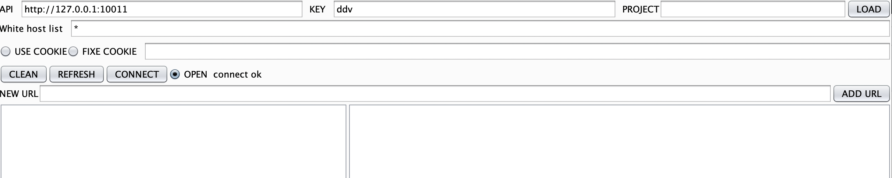
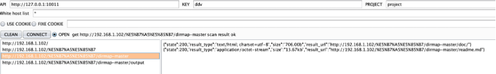
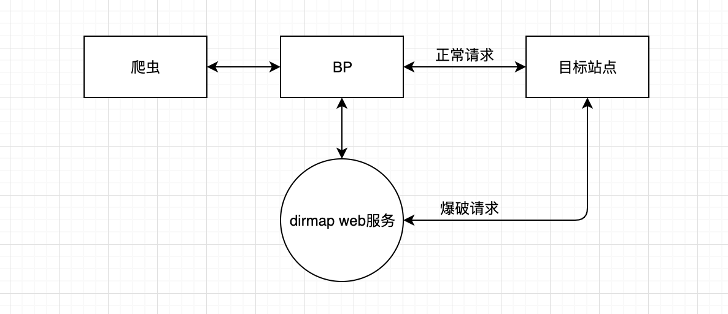

# dirmap_plus
dirmap增加web服务功能

一、	解决什么需求

    为什么还要做升级版的dirmap，是dirmap不够强悍么？（dirmap号称功能将会强于DirBuster、Dirsearch、cansina、御剑）。

常规的目录爆破，输入点通常是单个url或者多个url批量进行。但这都是固定的目标。当前这个方式对于简单明确url的资产可以进行。

在日常渗透的时候，时常会出现如下情况：

1、	一些多层级的url。例如：有个入口地址需要爆破，但是入口地址是多层级的地址（比如：http://xx.xx.xx/a/b/c/d/e/f.html），类似这种多层级地址，又需要每一级都进行爆破，那么如何节省人力的去爆破（每次手动拆分也不是个事吧），

2、	在进行API接口测试时出现的url地址也想进行爆破，还需要手动复制该地址出来再拿到扫描工具中进行工作。这也是一个费时费力费思绪的苦力劳动。

这种动态扫描的方式。在少量目标地址的情况下，勉强还能节省。如果有大量动态地址需要进行，那就是一个很头痛的事情。

那么如何在出现多层级和动态发现新地址的情况下，有效的进行目录爆破，同时又能节省人力。那就搞个升级版dirmap的玩玩。

	我们的目标：节省人力，把精力投入到脑力活动中去。

二、	对原版dirmap进行升级

    本着不重复造轮子宗旨，我们就加改吧。
当前版本的dirmap已经是一个功能非常丰富特别强的目录爆破工具了。基本使用可以去大佬的GitHub端详https://github.com/H4ckForJob/dirmap

2.1、dirmap新增部分
	当前dirmap添加目标的方式：
	
1、在命令行中使用-i参数添加单个目标地址；

2、在命令行中使用-iD参数以读取文件的方式添加多个目标。

以上两种方式都是基于固定目标url地址运行的。

运行方式为：添加目标地址 -》 运行dirmap -〉等待运行结束 -》 查看结果

下一波地址重新在命令行手动再运行一个轮回。

加整：

新增一个运行方式，循环运行。

新增一种从sqlite中加载目标的方式。

基本思路：
	循环运行从sqlite中读取新目标，发现有新目标就加载并进行爆破
	
	给dirmap增加了一个命令行参数-iD 该参数为sqlite名称。

2.2、附加脚本

	2.2.1、services.py
	
		开启web服务，提供API接口供外部远程添加待扫描地址，并将其写入到sqlite中，待dirmap加载运行。
		
		同时提供查询API接口供远程查询扫描结果。
		
	2.2.2、test.py
	
		该脚本主要为辅助脚本，提供查询当前sqlite内部数据，以及可创建新db功能。（可用可不用）
		

2.3、这样运行

	首先常规的使用方式还是可以正常使用的。具体见dirmap作者的GitHub端详https://github.com/H4ckForJob/dirmap
	
	第一步：使用 -iD 参数运行dirmap
	
		python3 dirmap.py -iD ddv.db -lcf
		

第二步：运行web服务脚本

运行前需要调整一下脚本参数

在第31行auth_key设置API接口的认证值

在第32行db_file_name设置sqlite文件名称（该文件名需要和dirmap参数-iD值一致）

	运行	python3 services.py
	

通过以上加增使dirmap具有开启web服务提供api接口的能力了。

以上dirmap新增部分。

三、	Burpsuite插件介绍

基本思路：获取bp抓的数据包，提取其中的url地址和cookie信息。将url和cookie数据发送到web服务中供dirmap扫描。在通过bp插件查询扫描的结束。（考虑到有些接口是需要待cookie的情况，那就把cookie也带上吧。）
	
	插件名：PathDirScan
	

其中

API输入框为services.py脚本开启的端口地址即可。

KEY输入框为api接口的认证值（在services.py第32行设置）。

PROJECT输入框为项目名称便于区分项目查询。

LOAD按钮将根据project值从服务端加载目标url地址信息

White host list输入框为白名单列表，如果需要扫描所有过bp的url 可以设置为 * （一般不建议这么做），通常设置目标单位的根域即可。

USE COOKIE选项为是否开启向api接口发送cookie值。

FIXE COOKIE选项为是否使用固定cookie发送，还是发送数据包的动态cookie。

CLEAN 按钮为清空已发送的目标url地址，也就是左侧的大框。

CONNECT按钮为测试API接口是否可用按钮。

OPEN选项为开启发送扫描地址给接口。

info（OPEN右侧）为提示信息显示。

NEW URL为手动点击目标url输入框。

ADD URL按钮将手动目标url发送到服务端。

左侧大框为发送给API接口的url地址（例如：http://x.x.x./a/b/c ，将会被自动解析为：http://x.x.x./ ，http://x.x.x./a/，http://x.x.x./a/b/，http://x.x.x./a/b/c ）

右侧大框为扫描的结果，点击左侧的url将加载对应的扫描结果。

操作逻辑：

根据自左向右，从上到下的逻辑进行填写。

API、KEY、white host list为必填项

每次修改参数后，需要点击一次CONNECT

然后在选中open选项。该选项需要在CONNECT后再选中

示例运行：

	在本地使用python3开启一个http.server服务
	
python3 -m http.server 80

访问的地址为http://192.168.1.102/%E5%B7%A5%E5%85%B7/dirmap-master/output/

BP插件截图

可见访问的是http://192.168.1.102/%E5%B7%A5%E5%85%B7/dirmap-master/output/

扫描出在http://192.168.1.102/%E5%B7%A5%E5%85%B7/dirmap-master/路径下的文件

使用test.py脚本可查看sqlite中的数据

四、	加入爬虫联动思路

实现自动化对目标站点所有url多层级进行目录爆破。只需要将爬虫代理到BP即可，
爬虫实现站点所有链接项获取。插件实现所有链接项拆解，并发送到dirmap服务中。dirmap实现对目标url的扫描。

五、	总结

经过加增后使dirmap具有提供web服务的能力。除了可以节省精力投入，方便爆破外。web服务方式可有效避免dirmap本地运行占用网络，IP频繁请求被封导致正常请求失效，本机性能消耗，dirmap服务器运行不便管理等问题。
同时在dirmap -iD模式下加入分散火力设计（例如：待扫描系统a有30个，b有30个，c有30个，为防止dirmap将爆破目标集中在同一个系统上，对目标系统造成影响。当前默认设计为同一个系统只放2个线程进行。【系统划分：host:port 为一个应用系统】）。

另外向dirmap（https://github.com/H4ckForJob/dirmap）作者致敬

